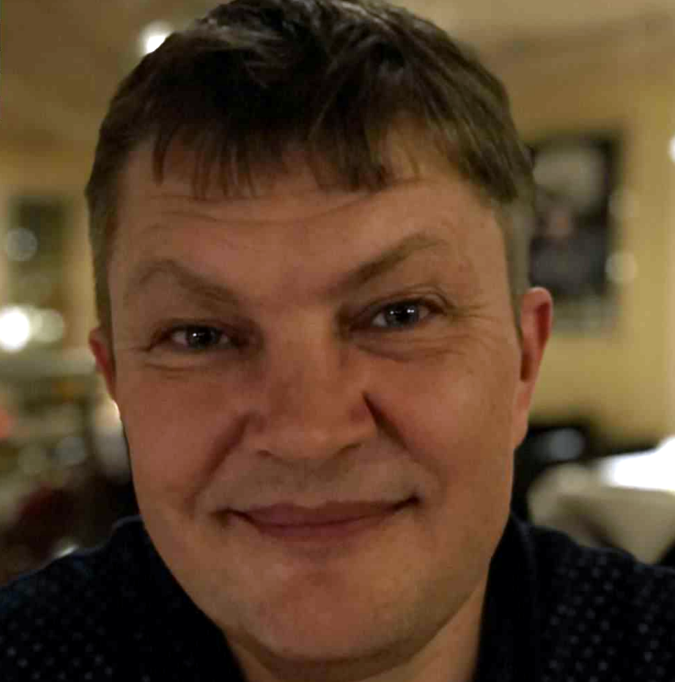

<table>
<tr>
<td width="120" valign="top">

</td>
<td>

# Karsten Sperling Opdal

**Developing Embedded Systems into the future of AI**

**Contact details** 
 
**Company:** Opdal Enterprise 
**Address:** Nordvangen 13, DK-4600 Køge 
**Phone:** +45 42 40 42 82 
**Email:** karsten.s.opdal@gmail.com 
**LinkedIn:** https://linkedin.com/in/karstenopdal-7a11512 
**Web:** https://opdal.dk 
**GitHub profile:** https://github.com/paletteguy

</td>
</tr>
</table>

---

## Summary

I make embedded Linux do what it's told — on hardware where failure isn't an option.

For 15 years at Laerdal Medical, I was the architect behind SimPad's embedded platform — owning everything from the Yocto build system delivering production Linux across ARM and x86, to the real-time simulation engine that brings medical manikins to life via CAN bus, IOC controllers, and physiological modelling. I evolved the build system through six major Yocto releases (Rocko to Scarthgap), migrated the platform from Ubuntu to a custom distribution with RAUC A/B OTA updates and HSM-signed security, and architected CI/CD pipelines with SBOM generation and CVE tracking for medical device compliance. Along the way I built Qt/QML touch-screen UIs, ALSA audio pipelines, WiFi/Bluetooth integration (with patches contributed to BlueZ and Qt Bluetooth), and a suite of internal tools — from an AI-powered diagnostic platform to an SSH certificate portal and a cross-platform device imager.

Before Laerdal, I spent a decade in the Nokia ecosystem — developing the user interfaces for the iconic 3210 and 3310, implementing concatenated SMS and T9 input, and building simulation tools that let engineers develop phone software in Visual Studio without touching hardware. I debugged firmware issues nobody else could crack, including a battery drain bug that improved battery lifetime by 30%. At Infineon, I shipped the Nokia 2110 low-cost platform where every kilobyte counted.

I own the full stack from silicon to screen: board bring-up on i.MX6, i.MX8, and x86, Linux kernel debugging and Device Tree customization, C++ services in real-time, and secure OTA deployment. I've integrated AI deeply into my engineering workflow — from AI-assisted code generation and review to building custom tooling around LLMs for debugging and documentation.

30+ years from Nokia handsets to medical devices. Now looking for the next platform worth building.

Copenhagen, Denmark | Open to remote across Europe

---

## Core Skills

C++ (C++23) · Embedded Linux · Yocto · Linux kernel · Qt/QML (Qt 3–6) · Python · WiFi/Bluetooth · CI/CD · Boost · AI-assisted engineering

---

## Experience

### Laerdal Medical
*Senior Software Engineer Consulting*
October 2010 – February 2026 (15 years 5 months)

- Senior Embedded Software Engineer / Build System Architect for SimPad devices / simulators and SimMan3G product lines.
- Lead maintainer of Yocto/OpenEmbedded build platform delivering production Linux across ARM32, ARM64, x86-32, and x86-64. Evolved through six major Yocto releases (Rocko to Scarthgap). Migrated from Ubuntu to custom distribution with RAUC A/B OTA updates and Azure Key Vault HSM signing.
- Architected multi-platform CI/CD pipelines with GitHub Actions, SBOM generation, and automated CVE tracking for medical device compliance.
- Linux kernel configuration, debugging, patching, and Device Tree customization across i.MX6, i.MX8M Plus, and Intel x86 — board bring-up, peripheral enablement, pin muxing, clock trees, and driver troubleshooting.
- Developed real-time simulation engine controlling medical manikins (SimMom, SimBaby, MammaAnne, SimMan ALS) via CAN bus or IOC controller and physiological modelling. C++ (up to C++23) with Boost, Qt 3–6 with deep QML expertise for embedded UIs. Proficient in C#.
- ALSA audio pipelines for clinical simulation. Bluetooth expert with patches to BlueZ and Qt Bluetooth stacks.
- Created SimServer Imager (Qt6/C++/QML) for managed WIC/VSI/SPU deployment and CDN distribution. Built VEX Kernel Checker — AI-assisted CVE analysis integrated with Dependency-Track. Built cross-platform companion app.
- Built SSH Certificate Portal (FastAPI/Python) — self-service time-limited SSH certificates with Azure AD OIDC, HSM-protected CA signing (RSA/ED25519/ECDSA), deployed on Azure App Service.
- Designed Azure Key Vault HSM signing workflow for RAUC bundles and secure boot — non-exportable keys, automated renewal via Azure Automation, multi-environment CI integration.
- Built SimServer Companion — AI-powered diagnostic platform using Claude/Gemini/OpenAI for crash analysis across SimPad, LinkBox, and CAN firmware. Jira automation, source context integration. Delivered as CLI, VS Code extension, and Tauri desktop app.

### Oscilloscope
*Senior Software Engineer Consulting*
October 2010 – June 2019 (8 years 9 months)

- Freelance

### Nokia
*Software Engineering Specialist*
April 2010 – October 2010 (7 months)

- I excelled in identifying and resolving complex firmware issues at Nokia, significantly enhancing product performance.
- Specialized in debugging intricate hardware/software interaction bugs on mobile platforms.
- Successfully fixed a battery drain issue that had persisted for years, improving battery lifetime by 30%.
- Developed critical skills in embedded systems analysis and problem-solving within a leading technology company.

### Nokia Mobile Phones
*Senior Software Engineering Consultant*
September 2008 – February 2010 (1 year 6 months)

- Provided expert consultation on the S40 platform software, focusing on bug fixing and error correction.
- Debugged firmware issues across the S40 software stack to enhance performance and reliability.
- Collaborated with cross-functional teams to ensure timely resolution of software defects, improving user experience.

### Infineon
*Software Expert*
October 2007 – September 2008 (1 year)

- Developed the Nokia 2110 low-cost phone platform during an expat assignment in Copenhagen.
- Optimized embedded software for resource-constrained hardware, ensuring efficient use of memory.
- Delivered high-quality software under tight deadlines, focusing on minimizing resource usage.

### Thorsø Data
*Software Expert*
October 2007 – September 2008 (1 year)

- In house Senior Contract Software Engineer

### Tang-Data A/S
*Senior Software Engineer*
March 2007 – October 2007 (8 months)

- Developed a comprehensive veterinary CRM system utilizing Qt 3 and Qt 4, enhancing client management.
- Provided on-site support for veterinary computer setups, ensuring seamless CRM hardware installations.
- Collaborated with cross-functional teams to address customer needs and improve system functionality.

### Nokia
*Senior Software Engineer*
October 2000 – February 2007 (6 years 5 months)

- Enhanced the software development lifecycle at Nokia through innovative UI development.
- Developed internal tools that streamlined handset software testing processes.
- Enabled mobile phone development in a simulated environment using Microsoft Visual Studio.

### EC-Soft Danmark A/S
*Senior System Software Engineer*
October 2000 – December 2001 (1 year 3 months)

- Consultant work for Nokia Denmark A/S developing S30 phones

### Telenor
*Contract Software Engineer*
April 2000 – June 2000 (3 months)

- Developed a web service for read outlook mails and calendar on phones

### EC-Soft Norge AS
*Senior Software Engineer*
May 2000 – October 2000 (6 months)

- In house Software Consultant

### Nokia
*Contract Software Engineer*
May 1999 – March 2000 (11 months)

- Developed user interfaces for Nokia's iconic handset models, including the 3210 and 3310.
- Collaborated with a fellow developer to implement concatenated SMS messaging, enhancing user communication.
- Integrated T9 input support, improving text input efficiency for users.

### EC-Soft Danmark A/S
*Software Consultant*
May 1999 – March 2000 (11 months)

- In house software consultant

### Vizion Factory ApS
*Software Engineer*
October 1995 – April 1999 (3 years 7 months)

- Played a key role in software development and early web solutions, contributing to the burgeoning internet landscape.
- Built applications that addressed emerging needs and developed a training engine paired with a web interface to streamline user interaction.

### Greve Kommune
*Network System Specialist*
January 1991 – October 1995 (4 years 10 months)

- Set up new networks to enhance connectivity and efficiency within the organization.
- Provided training to employees on computer use, fostering a tech-savvy workplace.
- Maintained hardware by adding and replacing components, ensuring optimal performance.

### Opdal Enterprise
*Owner*
September 2008 – Present (17 years 7 months)

- Køge Municipality

### Home development
*Developer*
April 1983 – Present (43 years)

- Developed Game for C-64, demos for C-64 and Amiga and a task / thread / resource manager for Amiga OS.
- Developed music editor software C-64, Amiga and PC Dos.
- Currently developing Android application for learning purpose and application with Rust and Svelte

---

## Github repositories

- https://github.com/paletteguy/profile
- https://github.com/Laerdal/vex-kernel-checker
- https://github.com/Laerdal/linux-fslc
- https://github.com/Laerdal/meta-dependencytrack
- https://github.com/Laerdal-Medical/simserver-imager

---

## Education

**Software development**

**Niels Brock**
Bachelor's Degree, Computer Science
September 1990 – June 1992

**Niels Brock**
Bachelor's Degree, Business/Commerce, General
August 1988 – June 1990

**EFG Handel og Kontor**
Basic business school
August 1987 – June 1988

**Krogaardskolen**
1976 – 1987
